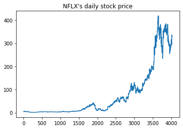
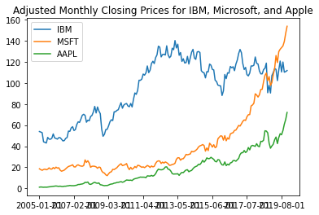
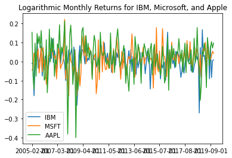

# Stock Comparison Data Analysis

I created this Jupyter Notebook for my team in the graduate-level Financial Data Analytics class in Fall Semester of 2022 of my M.S. Finance at Georgia State University. It presents a comprehensive analysis comparing stock prices and returns for Netflix (NFLX), IBM (IBM), Microsoft (MSFT), and Apple (AAPL) over different periods. The analysis covers data extraction, visualization, log return calculations, statistical testing, and the computation of holding period returns (HPR).

## Key Steps and Highlights

### 1. Data Extraction and Preparation
- **Netflix (NFLX)**: Daily stock prices were obtained from Yahoo Finance for the period from January 2, 2004, to December 31, 2019. The data was transformed into a DataFrame for exploration.
- **IBM, Microsoft, Apple**: Monthly adjusted closing prices for IBM, MSFT, and AAPL were obtained for the period from January 1, 2005, to December 31, 2019.

### 2. Data Exploration and Visualization
- **Price Plots**: Visualized the daily closing prices of NFLX and monthly adjusted closing prices of IBM, MSFT, and AAPL to observe general trends over time.
  - Netflix's stock price showed a steady increase from 2004 to 2019, with notable fluctuations during specific periods.
  - IBM, MSFT, and AAPL were plotted together to compare their performance, revealing that MSFT overtook IBM by the end of the period, while AAPL showed consistent growth.
 
  

### 3. Log Returns Calculation
- **Daily Log Returns for NFLX**: Calculated the daily log returns for NFLX using the formula “log(P1/P0)” to understand the stock's daily performance.
- **Monthly Log Returns for IBM, MSFT, and AAPL**: Computed monthly log returns for IBM, MSFT, and AAPL to evaluate their performance over the entire study period.

### 4. Statistical Analysis
- **Summary Statistics**: Generated summary statistics for the log returns of NFLX, IBM, MSFT, and AAPL:
  - **Netflix (NFLX)**: Mean return of 0.001, standard deviation of 0.034, min return of -0.526, and max return of 0.352.
  - **IBM**: Mean return of 0.004, standard deviation of 0.06, min of -0.27, and max of 0.168.
  - **MSFT**: Mean return of 0.012, standard deviation of 0.065, min of -0.181, and max of 0.223.
  - **AAPL**: Mean return of 0.023, standard deviation of 0.093, min of -0.4, and max of 0.213.

- **T-Test for Log Returns**: Conducted T-tests to evaluate whether the average log returns were statistically different from zero.
  - NFLX had a p-value of 4.3%, suggesting marginal statistical significance.
  - IBM had a p-value of 36.5%, indicating non-significance.
  - MSFT and AAPL both had significant p-values, with MSFT at 1.6% and AAPL at 0.1%, indicating strong evidence of non-zero mean returns.

### 5. Holding Period Return (HPR) Calculation
- Calculated the total and annualized holding period returns (HPR) for IBM, MSFT, and AAPL over the study period.
  - **IBM**: Total HPR of 196.18%, Annualized HPR of 7.51%
  - **MSFT**: Total HPR of 201.71%, Annualized HPR of 7.64%
  - **AAPL**: Total HPR of 36.96%, Annualized HPR of 2.12%

### 6. Distribution Analysis
- **Histograms**: Constructed histograms of daily returns for NFLX and monthly returns for IBM, MSFT, and AAPL to visualize the distribution.
  - IBM's histogram showed most returns clustered around -0.025 to 0.0, with high volatility.
  - MSFT's and AAPL's histograms revealed that returns clustered between 0.025 and 0.05, indicating relatively stable performance.

## Summary of Analysis
- Extracted and explored daily and monthly stock data for NFLX, IBM, MSFT, and AAPL, visualizing their price movements.
- Calculated log returns and conducted statistical tests to evaluate stock performance.
- IBM, MSFT, and AAPL showed consistent growth, with MSFT surpassing IBM in adjusted monthly closing prices by the end of the period.
- Conducted T-tests on log returns, finding significant non-zero returns for MSFT and AAPL.
- Computed holding period returns, revealing MSFT and IBM with higher annualized returns compared to AAPL.

 
